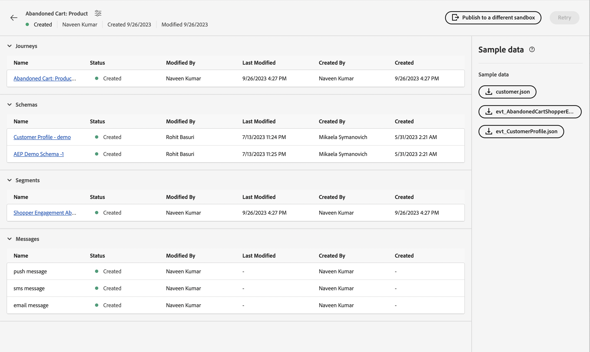

# Unitary-händelse

## Steg som ska följas {#steps-to-follow}

>[!CONTEXTUALHELP]
>id="marketerexp_sampledata_unitaryevent"
>title="Hur du använder?"
>abstract="Följ länken för mer information"

>[!IMPORTANT]
>
>Instruktionerna kan ändras över **[!UICONTROL Playbook]**, så referera alltid till exempeldataavsnittet i respektive **[!UICONTROL Playbook]**.

## Förutsättning

* Använd Playbook för att skapa instanser som **[!UICONTROL Journey]**, **[!UICONTROL Schemas]**, **[!UICONTROL Segments]**, **[!UICONTROL Messages]** osv.

* Skapade resurser visas på sidan `Bill Of Material`

<!-- TODO: attached image needs to change once postman is removed from UI -->


>[!TIP]
>
>Om du använder en terminal för att köra kurvorna kan du ange variabelvärden innan du kör kurvorna, så att du inte behöver ersätta dessa värden i enskilda kurvor.
>Om du till exempel anger `ORG_ID=**&#x200B;**&#x200B;**&#x200B;**&#x200B;**&#x200B;**@AdobeOrg` ersätts alla förekomster av `$ORG_ID` automatiskt med värdet, så att du kan kopiera, klistra in och köra rullarna nedan utan att några ändringar görs.
>
> Följande variabler används i hela dokumentet
>
> ACCESS_TOKEN
>
> API_KEY
>
> ORG_ID
>
> SANDBOX_NAME
>
> PROFILE_SCHEMA_REF
>
> PROFILE_DATASET_NAME
>
> PROFILE_DATASET_ID
>
> JOURNEY_ID
>
> PROFILE_BASE_CONNECTION_ID
>
> PROFILE_SOURCE_CONNECTION_ID
>
> PROFILE_TARGET_CONNECTION_ID
>
> PROFILE_INLET_URL
>
> CUSTOMER_MOBILE_NUMBER
>
> CUSTOMER_FIRST_NAME
>
> CUSTOMER_LAST_NAME
>
> E-POST
>
> EVENT_SCHEMA_REF
>
> EVENT_DATASET_NAME
>
> EVENT_DATASET_ID
>
> EVENT_BASE_CONNECTION_ID
>
> EVENT_SOURCE_CONNECTION_ID
>
> EVENT_TARGET_CONNECTION_ID
>
> EVENT_INLET_URL
>
> TIDSSTÄMPEL
>
> UNIQUE_EVENT_ID

## Hämta IMS-token

1. Följ dokumentationen för [Autentisera och få åtkomst till Experience Platform API:er](https://experienceleague.adobe.com/docs/experience-platform/landing/platform-apis/api-authentication.html) för att generera åtkomsttoken.

## Publish den resa som skapats av Playbook

Det finns två sätt att publicera resan. Du kan välja något av dem:

1. **Använd AJO-gränssnittet** - klicka på länken Resa på `Bill Of Material Page`. Detta dirigerar om dig till sidan Resa där du kan klicka på knappen **[!UICONTROL Publish]** så publiceras resan.

   

1. **Använder cURL**

   1. Publish resan. Svaret innehåller det jobb-ID som behövs i nästa steg för att hämta resepubliceringsstatus.

      ```bash
      curl --location --request POST "https://journey-private.adobe.io/authoring/jobs/journeyVersions/$JOURNEY_ID/deploy" \
      --header "Accept: */*" \
      --header "Authorization: Bearer $ACCESS_TOKEN" \
      --header "x-api-key: $API_KEY" \
      --header "x-gw-ims-org-id: $ORG_ID" \
      --header "x-sandbox-name: $SANDBOX_NAME" \
      --header "Content-Type: application/json" 
      ```

   1. Det kan ta en stund att publicera på resan, så för att kontrollera status som körs under cURL, tills `response.status` är `SUCCESS`, måste du vänta i 10-15 sekunder om det tar tid att publicera på resan.

      ```bash
      curl --location "https://journey-private.adobe.io/authoring/jobs/$JOB_ID" \
      --header "Authorization: Bearer $ACCESS_TOKEN" \
      --header "x-api-key: $API_KEY" \
      --header "x-gw-ims-org-id: $ORG_ID" \
      --header "x-sandbox-name: $SANDBOX_NAME" \
      --header "Content-Type: application/json"
      ```

## Infoga kundprofil

>[!TIP]
>
>Om din e-postleverantör stöder plus-e-post kan du återanvända samma e-postadress genom att lägga till `+<variable>` i din e-postadress. `usertest@email.com` kan t.ex. återanvändas som `usertest+v1@email.com` eller `usertest+24jul@email.com`. Det är praktiskt att ha en ny profil varje gång, men ändå använda samma e-post-id.
>
>P.S: Plus-e-post är en konfigurerbar funktion som måste stödjas av e-postleverantörer. Kontrollera om du kan ta emot e-post om sådana adresser innan du använder dem i test.

1. Första gången användaren måste skapa **[!DNL customer dataset]** och **[!DNL HTTP Streaming Inlet Connection]**.
1. Om du redan har skapat **[!DNL customer dataset]** och **[!DNL HTTP Streaming Inlet Connection]** går du vidare till steget `5`.
1. Skapa en kundprofildatauppsättning genom att köra nedanstående cURL.

   ```bash
   curl --location "https://platform.adobe.io/data/foundation/catalog/dataSet" \
   --header "Authorization: Bearer $ACCESS_TOKEN" \
   --header "x-gw-ims-org-id: $ORG_ID" \
   --header "x-sandbox-name: $SANDBOX_NAME" \
   --header "x-api-key: $API_KEY" \
   --header "Content-Type: application/json" \
   --data '{
       "name": "'$PROFILE_DATASET_NAME'",
       "schemaRef": {
           "id": "'$PROFILE_SCHEMA_REF'",
           "contentType": "application/vnd.adobe.xed-full-notext+json; version=1"
       },
       "tags": {
           "unifiedProfile": [
           "enabled:true"
           ],
           "unifiedIdentity": [
           "enabled:true"
           ]
       },
       "fileDescription": {
           "persisted": true,
           "containerFormat": "parquet",
           "format": "parquet"
       }
   }'
   ```

   Svaret har formatet `"@/dataSets/<PROFILE_DATASET_ID>"`.

1. Skapa **[!DNL HTTP Streaming Inlet Connection]** med hjälp av följande steg.
   1. Skapa en basanslutning.

      ```bash
      curl --location "https://platform.adobe.io/data/foundation/flowservice/connections?Cache-Control=no-cache" \
      --header "Authorization: Bearer $ACCESS_TOKEN" \
      --header "x-gw-ims-org-id: $ORG_ID" \
      --header "x-sandbox-name: $SANDBOX_NAME" \
      --header "x-api-key: $API_KEY" \
      --header "Content-Type: application/json" \
      --data '{
          "name": "AbandonedCartProduct_Base_ConnectionForCustomerProfile_1694458293",
          "description": "Marketer Playground Playbook-Validation Customer Profile Base Connection 1",
          "auth": {
              "specName": "Streaming Connection",
              "params": {
                  "dataType": "xdm"
              }
          },
          "connectionSpec": {
              "id": "bc7b00d6-623a-4dfc-9fdb-f1240aeadaeb",
              "version": "1.0"
          }
      }'
      ```

      Hämta ett basanslutnings-ID från svaret och använd det i stället för `PROFILE_BASE_CONNECTION_ID` i följande cURL:er

   1. Skapa källanslutning.

      ```bash
      curl --location "https://platform.adobe.io/data/foundation/flowservice/sourceConnections" \
      --header "Authorization: Bearer $ACCESS_TOKEN" \
      --header "x-gw-ims-org-id: $ORG_ID" \
      --header "x-sandbox-name: $SANDBOX_NAME" \
      --header "Content-Type: application/json" \
      --header "x-api-key: $API_KEY" \
      --data '{
          "name": "AbandonedCartProduct_Source_ConnectionForCustomerProfile_1694458318",
          "description": "Marketer Playground Playbook-Validation Customer Profile Source Connection 1",
          "baseConnectionId": "'$PROFILE_BASE_CONNECTION_ID'",
          "connectionSpec": {
              "id": "bc7b00d6-623a-4dfc-9fdb-f1240aeadaeb",
              "version": "1.0"
          }
      }'
      ```

      Hämta källanslutnings-ID från svaret och använd det i stället för `PROFILE_SOURCE_CONNECTION_ID`

   1. Skapa målanslutning.

      ```bash
      curl --location "https://platform.adobe.io/data/foundation/flowservice/targetConnections" \
      --header "Authorization: Bearer $ACCESS_TOKEN" \
      --header "x-gw-ims-org-id: $ORG_ID" \
      --header "x-sandbox-name: $SANDBOX_NAME" \
      --header "Content-Type: application/json" \
      --header "x-api-key: $API_KEY" \
      --data '{
          "name": "AbandonedCartProduct_Target_ConnectionForCustomerProfile_1694458407",
          "description": "Marketer Playground Playbook-Validation Customer Profile Target Connection 1",
          "data": {
              "format": "parquet_xdm",
              "schema": {
                  "version": "application/vnd.adobe.xed-full+json;version=1",
                  "id": "'$PROFILE_SCHEMA_REF'"
              },
              "properties": null
          },
          "connectionSpec": {
              "id": "c604ff05-7f1a-43c0-8e18-33bf874cb11c",
              "version": "1.0"
          },
          "params": {
              "dataSetId": "'$PROFILE_DATASET_ID'"
          }
      }'
      ```

      Hämta målanslutnings-ID från svaret och använd det i stället för `PROFILE_TARGET_CONNECTION_ID`

   1. Skapa ett dataflöde.

      ```bash
      curl --location "https://platform.adobe.io/data/foundation/flowservice/flows" \
      --header "Authorization: Bearer $ACCESS_TOKEN" \
      --header "x-gw-ims-org-id: $ORG_ID" \
      --header "x-sandbox-name: $SANDBOX_NAME" \
      --header "Content-Type: application/json" \
      --header "x-api-key: $API_KEY" \
      --data '{
          "name": "AbandonedCartProduct_Dataflow_ForCustomerCustomerProfile_1694460528",
          "description": "Marketer Playground Playbook-Validation Customer Profile Dataflow 1",
          "flowSpec": {
              "id": "d8a6f005-7eaf-4153-983e-e8574508b877",
              "version": "1.0"
          },
          "sourceConnectionIds": [
              "'$PROFILE_SOURCE_CONNECTION_ID'"
          ],
          "targetConnectionIds": [
              "'$PROFILE_TARGET_CONNECTION_ID'"
          ]
      }'
      ```

   1. Hämta basanslutning. Resultatet innehåller den inletUrl som krävs för att skicka profildata.

      ```bash
      curl --location "https://platform.adobe.io/data/foundation/flowservice/connections/$PROFILE_BASE_CONNECTION_ID" \
      --header "Authorization: Bearer $ACCESS_TOKEN" \
      --header "x-gw-ims-org-id: $ORG_ID" \
      --header "x-sandbox-name: $SANDBOX_NAME" \
      --header "Content-Type: application/json" \
      --header "x-api-key: $API_KEY"
      ```

      Hämta inletUrl från svaret och använd det i stället för `PROFILE_INLET_URL`

1. I det här steget måste användaren ha värdena `PROFILE_DATASET_ID` och `PROFILE_INLET_URL`. Om inte, se steg `3` respektive `4`.
1. Användaren måste ersätta `CUSTOMER_MOBILE_NUMBER`, `CUSTOMER_FIRST_NAME`, `CUSTOMER_LAST_NAME` och `EMAIL` under cURL:er för att kunna importera kunden.

   1. `CUSTOMER_MOBILE_NUMBER` skulle vara mobilnummer, t.ex. `+1 000-000-0000`
   1. `CUSTOMER_FIRST_NAME` skulle vara användarens förnamn
   1. `CUSTOMER_LAST_NAME` skulle vara användarens efternamn
   1. `EMAIL` skulle vara användarens e-postadress. Detta är viktigt att använda distinkt e-post-ID så att en ny profil kan hämtas.

1. Kör sedan kontrollen för att importera kundprofil. Uppdatera `body.xdmEntity.consents.marketing.preferred` till `email`, `sms` eller `push` baserat på de kanaler som du tänker verifiera. Ange även motsvarande `val` till `y`.

   ```bash
   curl --location "$PROFILE_INLET_URL?synchronousValidation=true" \
   --header 'Content-Type: application/json' \
   --data-raw '{
       "header": {
           "schemaRef": {
               "id": "'$PROFILE_SCHEMA_REF'",
               "contentType": "application/vnd.adobe.xed-full+json;version=1.0"
           },
           "imsOrgId": "'$ORG_ID'",
           "datasetId": "'$PROFILE_DATASET_ID'",
           "source": {
               "name": "Streaming dataflow - 1694460605"
           }
       },
       "body": {
           "xdmMeta": {
               "schemaRef": {
                   "id": "'$PROFILE_SCHEMA_REF'",
                   "contentType": "application/vnd.adobe.xed-full+json;version=1.0"
               }
           },
           "xdmEntity": {
           "consents": {
               "marketing": {
                   "preferred": "email",
                   "email": {
                       "val": "y"
                   },
                   "push": {
                       "val": "n"
                   },
                   "sms": {
                       "val": "n"
                   }
               }
           },
           "mobilePhone": {
               "number": "'$CUSTOMER_MOBILE_NUMBER'",
               "status": "active"
           },
           "person": {
               "name": {
               "firstName": "'$CUSTOMER_FIRST_NAME'",
               "lastName": "'$CUSTOMER_LAST_NAME'"
               }
           },
           "personalEmail": {
               "address": "'$EMAIL'"
           },
           "testProfile": false
           }
       }
   }'
   ```

## Ingest Journey Trigger Event

1. Första gången användaren måste skapa **[!DNL event dataset]** och **[!DNL HTTP Streaming Inlet Connection for events]**
1. Om du redan har skapat **[!DNL event dataset]** och **[!DNL HTTP Streaming Inlet Connection for events]** går du vidare till steget `5`.
1. Skapa en händelsedatamängd genom att köra nedanstående cURL.

   ```bash
   curl --location "https://platform.adobe.io/data/foundation/catalog/dataSet" \
   --header "Authorization: Bearer $ACCESS_TOKEN" \
   --header "x-gw-ims-org-id: $ORG_ID" \
   --header "x-sandbox-name: $SANDBOX_NAME" \
   --header "x-api-key: $API_KEY" \
   --header "Content-Type: application/json" \
   --data '{
       "name": "'$EVENT_DATASET_NAME'",
       "schemaRef": {
           "id": "'$EVENT_SCHEMA_REF'",
           "contentType": "application/vnd.adobe.xed-full-notext+json; version=1"
       },
       "tags": {
           "unifiedProfile": [
               "enabled:true"
           ],
           "unifiedIdentity": [
               "enabled:true"
           ]
       },
       "fileDescription": {
           "persisted": true,
           "containerFormat": "parquet",
           "format": "parquet"
       }
   }'
   ```

   Svaret har formatet `"@/dataSets/<EVENT_DATASET_ID>"`

1. Skapa **[!DNL HTTP Streaming Inlet Connection for events]** med hjälp av följande steg.
   <!-- TODO: Is the name unique? If so, we may need to generate and provide in variables.txt-->
   1. Skapa en basanslutning.

      ```bash
      curl --location "https://platform.adobe.io/data/foundation/flowservice/connections?Cache-Control=no-cache" \
      --header "Authorization: Bearer $ACCESS_TOKEN" \
      --header "x-gw-ims-org-id: $ORG_ID" \
      --header "x-sandbox-name: $SANDBOX_NAME" \
      --header "x-api-key: $API_KEY" \
      --header "Content-Type: application/json" \
      --data '{
          "name": "AbandonedCartProduct_Base_ConnectionForAEPDemoSchema_1694461448",
          "description": "Marketer Playground Playbook-Validation AEP Demo Schema Base Connection 1",
          "auth": {
              "specName": "Streaming Connection",
              "params": {
                  "dataType": "xdm"
              }
          },
          "connectionSpec": {
              "id": "bc7b00d6-623a-4dfc-9fdb-f1240aeadaeb",
              "version": "1.0"
          }
      }'
      ```

      Hämta ett basanslutnings-ID från svaret och använd det i stället för `EVENT_BASE_CONNECTION_ID`

   1. Skapa källanslutning.

      ```bash
      curl --location "https://platform.adobe.io/data/foundation/flowservice/sourceConnections" \
      --header "Authorization: Bearer $ACCESS_TOKEN" \
      --header "x-gw-ims-org-id: $ORG_ID" \
      --header "x-sandbox-name: $SANDBOX_NAME" \
      --header "x-api-key: $API_KEY" \
      --header "Content-Type: application/json" \
      --data '{
          "name": "AbandonedCartProduct_Source_ConnectionForAEPDemoSchema_1694461464",
          "description": "Marketer Playground Playbook-Validation AEP Demo Schema Source Connection 1",
          "baseConnectionId": "'$EVENT_BASE_CONNECTION_ID'",
          "connectionSpec": {
              "id": "bc7b00d6-623a-4dfc-9fdb-f1240aeadaeb",
              "version": "1.0"
          }
      }'
      ```

      Hämta källanslutnings-ID från svaret och använd det i stället för `EVENT_SOURCE_CONNECTION_ID`

   1. Skapa målanslutning.

      ```bash
      curl --location "https://platform.adobe.io/data/foundation/flowservice/sourceConnections" \
      --header "Authorization: Bearer $ACCESS_TOKEN" \
      --header "x-gw-ims-org-id: $ORG_ID" \
      --header "x-sandbox-name: $SANDBOX_NAME" \
      --header "x-api-key: $API_KEY" \
      --header "Content-Type: application/json" \
      --data '{
          "name": "AbandonedCartProduct_Target_ConnectionForAEPDemoSchema_1694802667",
          "description": "Marketer Playground Playbook-Validation AEP Demo Schema Target Connection 1",
          "data": {
              "format": "parquet_xdm",
              "schema": {
                  "version": "application/vnd.adobe.xed-full+json;version=1",
                  "id": "'$EVENT_SCHEMA_REF'"
              },
              "properties": null
          },
          "connectionSpec": {
              "id": "c604ff05-7f1a-43c0-8e18-33bf874cb11c",
              "version": "1.0"
          },
          "params": {
              "dataSetId": "'$EVENT_DATASET_ID'"
          }
      }'
      ```

      Hämta målanslutnings-ID från svaret och använd det i stället för `EVENT_TARGET_CONNECTION_ID`

   1. Skapa ett dataflöde.

      ```bash
      curl --location "https://platform.adobe.io/data/foundation/flowservice/flows" \
      --header "Authorization: Bearer $ACCESS_TOKEN" \
      --header "x-gw-ims-org-id: $ORG_ID" \
      --header "x-sandbox-name: $SANDBOX_NAME" \
      --header "x-api-key: $API_KEY" \
      --header "Content-Type: application/json" \
      --data '{
          "name": "AbandonedCartProduct_Dataflow_ForCustomerAEPDemoSchema_1694461564",
          "description": "Marketer Playground Playbook-Validation AEP Demo Schema Dataflow 1",
          "flowSpec": {
              "id": "d8a6f005-7eaf-4153-983e-e8574508b877",
              "version": "1.0"
          },
          "sourceConnectionIds": [
              "'$EVENT_SOURCE_CONNECTION_ID'"
          ],
          "targetConnectionIds": [
              "'$EVENT_TARGET_CONNECTION_ID'"
          ]
      }'
      ```

   1. Hämta basanslutning. Resultatet innehåller den inletUrl som krävs för att skicka profildata.

   ```bash
   curl --location "https://platform.adobe.io/data/foundation/flowservice/connections/$EVENT_BASE_CONNECTION_ID" \
       --header "Authorization: Bearer $ACCESS_TOKEN" \
       --header "x-gw-ims-org-id: $ORG_ID" \
       --header "x-sandbox-name: $SANDBOX_NAME" \
       --header "x-api-key: $API_KEY" \
       --header "Content-Type: application/json" 
   ```

   Hämta inletUrl från svaret och använd det i stället för `EVENT_INLET_URL`

1. I det här steget måste användaren ha värdena `EVENT_DATASET_ID` och `EVENT_INLET_URL`. Om inte, se steg `3` respektive `4`.
1. Användaren måste ändra tidsvariabeln `TIMESTAMP` i begärandetexten för cURL nedan för att kunna importera händelsen.

   1. Ersätt `body.xdmEntity` med innehållet i hämtad händelse-json.
   1. `TIMESTAMP` använder tidsstämpeln i UTC-tidszonen, till exempel `2023-09-05T23:57:00.071+00:00`, när en händelse inträffar.
   1. Ange ett unikt värde för variabeln `UNIQUE_EVENT_ID`.

   ```bash
   curl --location "$EVENT_INLET_URL?synchronousValidation=true" \
   --header 'Content-Type: application/json' \
   --data-raw '{
       "header": {
           "schemaRef": {
               "id": "'$EVENT_SCHEMA_REF'",
               "contentType": "application/vnd.adobe.xed-full+json;version=1.0"
           },
           "imsOrgId": "'$ORG_ID'",
           "datasetId": "'$EVENT_DATASET_ID'",
           "source": {
               "name": "Streaming dataflow - 8/31/2023 9:04:25 PM"
           }
       },
       "body": {
           "xdmMeta": {
               "schemaRef": {
                   "id": "'$EVENT_SCHEMA_REF'",
                   "contentType": "application/vnd.adobe.xed-full+json;version=1.0"
               }
           },
           "xdmEntity": {
               "endUserIDs": {
                   "_experience": {
                       "aaid": {
                           "id": "'$EMAIL'"
                       },
                       "emailid": {
                           "id": "'$EMAIL'"
                       }
                   }
               },
               "_experience": {
                   "analytics": {
                       "customDimensions": {
                           "eVars": {
                           "eVar235": "AC11147"
                           }
                       }
                   }
               },
               "_id": "'$UNIQUE_EVENT_ID'",
               "commerce": {
                   "productListAdds": {
                       "value": 11498
                   }
               },
               "eventType": "commerce.productListAdds",
               "productListItems": [
                   {
                       "_id": "ACS1620",
                       "SKU": "P1",
                       "_experience": {
                           "analytics": {
                           "customDimensions": {
                               "eVars": {
                                   "eVar1": "Pants"
                               }
                           }
                           }
                       },
                       "currencyCode": "USD",
                       "name": "Sample value",
                       "priceTotal": 30841.13,
                       "product": "https://ns.adobe.com/xdm/common/uri",
                       "productAddMethod": "Sample value",
                       "quantity": 1
                   },
                   {
                       "_id": "ACS1729",
                       "SKU": "P2",
                       "_experience": {
                           "analytics": {
                               "customDimensions": {
                                   "eVars": {
                                       "eVar1": "Galliano"
                                   }
                               }
                           }
                       },
                       "currencyCode": "USD",
                       "name": "Sample value",
                       "priceTotal": 20841.13,
                       "product": "https://ns.adobe.com/xdm/common/uri",
                       "productAddMethod": "Sample value",
                       "quantity": 2
                   }
               ],
               "timestamp": "'$TIMESTAMP'",
               "web": {
                   "webInteraction": {
                       "URL": "https://experienceleague.adobe.com/docs/experience-platform/edge/data-collection/collect-commerce-data.html?lang=en",
                       "name": "Sample value",
                       "region": "Sample value"
                   },
                   "webPageDetails": {
                       "URL": "https://experienceleague.adobe.com/docs/experience-platform/edge/data-collection/collect-commerce-data.html?lang=en",
                       "isErrorPage": false,
                       "isHomePage": false,
                       "name": "Sample value",
                       "pageViews": {
                           "id": "Sample value",
                           "value": 1
                       },
                       "server": "Sample value",
                       "siteSection": "Sample value",
                       "viewName": "Sample value"
                   },
                   "webReferrer": {
                   "URL": "Sample value",
                   "type": "internal"
                   }
               }
           }
       }
   }'
   ```

## Slutlig validering

Du måste få ett meddelande om den valda kanal som används i **[!DNL Ingest the Customer Profile]** steg `8`

* `SMS` om den önskade kanalen är `sms` på `customer_country_code` och `customer_mobile_no`
* `Email` om den önskade kanalen är `email` på `email`

Du kan även kontrollera `Journey Report` genom att klicka på `Journey Object` på `Bill of Materials page`. Du omdirigeras då till `Journey Details page`.

För varje publicerad reseanvändare måste en **[!UICONTROL View report]**-knapp hämtas


## Rensa

Låt inte flera instanser av `Journey` köras samtidigt. Vänligen stoppa resan om den bara är till för validering när valideringen har slutförts.
